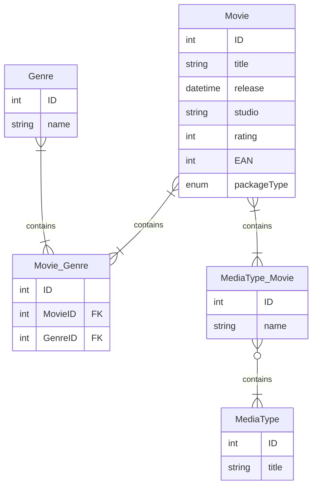

# Media Collection Manager

## Achtergrond
Ik heb een vrij grote collectie aan zowel fysieke als digitale media. Hierom is het moeilijk om allemaal te onthouden wat ik wel en niet heb, en op welk platform/console. Het is me inmiddels nu al meerdere keren gebeurd dat ik een spel dubbel gekocht heb omdat ik vergeten was dat ik het al (ergens anders) had.

## Doelgroep
Gezien het feit dat dit een persoonlijk project is, ben ik zelf de hoofdzakelijke doelgroep. Als er enige andere mensen zijn die voordeel kunnen halen uit de functionaliteiten van dit project is dat mooi meegenomen, maar het is niet de focus. Er wordt van gebruikers verwacht dat zij op zijn minst in staat zijn om (of te leren hoe zij) een webserver opzetten en hier een app op kunnen hosten.
## Doel
Ik wil een app maken waarin ik kan bijhouden welke media ik allemaal bezit en voor welke platform(en)/medium. Hiermee kan ik dit makkelijk bijhouden en controleren welke media ik heb.

## Gebruikte Technologieën
In dit project wordt gebruik gemaakt van een aantal verschillende technologieën, tools en frameworks. Hieronder is een korte beschrijven van elk van deze.

### Node.js
Node.js is een open-source, cross-platform runtime-omgeving waarmee je JavaScript kunt uitvoeren buiten de browser, zoals op servers. Het is gebouwd op de V8 JavaScript-engine van Google Chrome, waardoor het snel en efficiënt werkt. Node.js wordt vaak gebruikt voor het ontwikkelen van server-side toepassingen, zoals API’s en real-time apps. Het maakt gebruik van een event-driven, non-blocking I/O-model, wat betekent dat het meerdere verzoeken tegelijk kan afhandelen zonder vast te lopen, ideaal voor schaalbare netwerkomgevingen. Met een uitgebreide pakketmanager, npm (Node Package Manager), biedt Node.js toegang tot een gigantische bibliotheek aan tools en modules die het ontwikkelingsproces versnellen.

### Typescript

Typescript is een superset van JavaScript die extra features toevoegt, zoals statische typering. Dit maakt het makkelijker om fouten op te sporen tijdens de ontwikkelingsfase, voordat de code wordt uitgevoerd. Typescript code wordt gecompileerd naar JavaScript code die vervolgens kan worden uitgevoerd in een browser of in een Node.js omgeving. Het helpt bij het schrijven van grotere en complexere applicaties door code beter te structureren en te organiseren. Met TypeScript krijg je toegang tot een aantal handige tools en modules die het ontwikkelingsproces versnellen.

### React
React.js, vaak kortweg React genoemd, is een open-source JavaScript-bibliotheek ontwikkeld door Meta (voorheen Facebook) voor het bouwen van gebruikersinterfaces, met name voor single-page applicaties. Het maakt gebruik van een componentgebaseerde architectuur, waarbij de interface wordt opgedeeld in herbruikbare en zelfstandige componenten. React werkt met een virtual DOM (Document Object Model), wat ervoor zorgt dat alleen de noodzakelijke delen van de webpagina worden bijgewerkt, waardoor de prestaties verbeteren. Het ondersteunt unidirectionele dataflow, wat zorgt voor meer controle over hoe gegevens door de applicatie stromen. React is flexibel en wordt vaak gecombineerd met andere tools en bibliotheken om complexe applicaties te bouwen. Het is geliefd vanwege de eenvoud, snelheid en de enorme community eromheen.

### Next.js
Next.js is een populair open-source framework gebaseerd op React, ontworpen voor het bouwen van moderne webapplicaties. Het biedt functies zoals server-side rendering (SSR) en static site generation (SSG), wat betekent dat pagina’s vooraf gerenderd kunnen worden op de server of statisch worden opgebouwd voor snellere laadtijden en betere SEO. Met Next.js kun je dynamische routes eenvoudig maken en API-routes integreren in hetzelfde project. Het ondersteunt ook hot reloading, waardoor wijzigingen direct zichtbaar zijn tijdens het ontwikkelen. Daarnaast biedt het out-of-the-box ondersteuning voor TypeScript, CSS-modules, en de mogelijkheid om middleware en serverfuncties te gebruiken. Next.js is ideaal voor ontwikkelaars die flexibele en krachtige webapplicaties willen bouwen met minimale configuratie.

### MariaDB
MariaDB is een open-source relationele database die is ontstaan als een fork van MySQL. Het wordt ontwikkeld en onderhouden door de gemeenschap, met als doel dezelfde functionaliteit als MySQL te bieden maar zonder afhankelijk te zijn van Oracle, de eigenaar van MySQL. MariaDB ondersteunt SQL (Structured Query Language) voor het beheren en opvragen van gegevens en is compatibel met veel populaire applicaties en tools. Het biedt extra functies zoals verbeterde opslag-engines, betere prestaties en veiligheid, en ondersteuning voor meer moderne standaarden zoals JSON en geavanceerde replicatie-opties. MariaDB is betrouwbaar en schaalbaar, waardoor het geschikt is voor zowel kleine projecten als grote, complexe bedrijfsapplicaties.

### Docker
Docker is een open-source platform dat software ontwikkelaars helpt om applicaties te bouwen, te distribueren en uit te voeren in containers. Containers zijn lichte, geïsoleerde omgevingen die alle benodigde bestanden, bibliotheken en afhankelijkheden bevatten om een applicatie consistent te laten draaien, ongeacht de onderliggende infrastructuur. Dit maakt het mogelijk om "build once, run anywhere" te realiseren. Docker gebruikt container-images, die als blauwdruk fungeren, en biedt tools zoals Docker Engine om containers te draaien, en Docker Hub om images te delen. Het vereenvoudigt de ontwikkeling, test en implementatie van software, doordat het afhankelijkheidsproblemen elimineert en applicaties schaalbaar en eenvoudig verplaatsbaar maakt.

### Docker Compose
Docker Compose is een hulpmiddel dat bij Docker hoort en wordt gebruikt om multi-container applicaties eenvoudig te definiëren en te beheren. Met Docker Compose kun je een YAML-bestand (`docker-compose.yml`) schrijven waarin je alle services beschrijft die je applicatie nodig heeft, zoals een database, een webserver en een applicatieservice. In plaats van elke container afzonderlijk op te starten, kun je met één enkele opdracht (`docker-compose up`) alle containers in de juiste volgorde starten en configureren. Het ondersteunt functies zoals netwerken, volumebeheer en het automatisch herstarten van containers. Docker Compose maakt het ontwikkelen en testen van complexe applicaties met meerdere componenten veel eenvoudiger en gestroomlijnder.

### Prisma ORM
Prisma ORM is een moderne en type-safe Object-Relational Mapper (ORM) voor Node.js, TypeScript en Javascript. Het biedt ontwikkelaars een eenvoudige en intuïtieve manier om met relationele databases te werken, zoals PostgreSQL, MySQL/MariaDB en SQLite. Met functies zoals migratiebeheer, relationele query’s en een krachtige query engine helpt Prisma om sneller en betrouwbaarder databasegedreven applicaties te bouwen.

### Shadcn UI
Shadcn UI is een op Tailwind CSS gebaseerde componentenbibliotheek voor React, ontworpen met een focus op toegankelijkheid, herbruikbaarheid en esthetiek. In plaats van een traditionele npm-package is Shadcn UI een verzameling kopieerbare en aanpasbare componenten die je lokaal in je project beheert. Dit geeft ontwikkelaars volledige controle over styling en functionaliteit, terwijl ze profiteren van vooraf gebouwde, goed doordachte UI-patronen. Het is populair in moderne frontend-projecten vanwege de flexibiliteit, de sterke integratie met Radix UI en de communitygedreven aanpak.

### TailwindCSS
Tailwind CSS is een utility-first CSS-framework waarmee je snel en efficiënt gebruikersinterfaces kunt bouwen door middel van herbruikbare CSS-klassen. In plaats van vooraf ontworpen componenten te gebruiken, stel je met Tailwind je eigen ontwerpen samen door kleine, semantische klassen toe te passen op HTML-elementen. Dit zorgt voor meer controle, minder custom CSS en betere consistentie in je ontwerp. Dankzij de diepe integratie met moderne buildtools en de focus op developer experience is Tailwind CSS uitgegroeid tot een van de populairste keuzes voor het bouwen van responsieve en onderhoudbare frontends.

## Eisen, Wensen en randvoorwaarden
### Randvoorwaarden
De hoofdzakelijke randvoorwaarde is dat het front-end gemaakt moet zijn met React.js. Dit omdat dit een project is voor mij om meer ervaring op te doen met React.js en mijn kennis en ervaring hiermee te tonen. Daarnaast is het een eis dat het mogelijk is om dit project te *'self-hosten'*. Dit omdat er geen budget binnen dit project is voor hosting op een 3rd party.

### Functionele eisen
Hier zijn de functionele eisen die worden meegenomen in dit project.
#### Basisinformatie media item
Het doel van deze applicatie is het kunnen noteren van informatie over een media item en voor welk platform/medium ik deze heb, het is daarom essentieel dat het mogelijk is binnen de app om enige basisinformatie te kunnen noteren van een film/serie en zijn rol binnen mijn collectie. 
**De informatie die genoteerd moet kunnen worden is:**
- Titel film/serie
- Is het een film of een serie?
- Uitgever
- Studio
- Jaar van uitkomst
- [[#Platformen|Platform]] waar ik het voor heb
- Genre(s)
- Cover art
#### Afbeelding film/serie
Het zou mooi zijn als het mogelijk is om eventueel een afbeelding van de boxart/filmposdter o.i.d. toe te voegen. Misschien een foto van je daadwerkelijke kopie, voor vergelijken van conditie met andere.
#### Platformen
Media komt vaak uit voor meer dan één platform/medium. Om onderscheid te maken voor welke platformen of media ik een film/serie heb, is het belangrijk om dit bij een media item aan te kunnen geven. Zodat ik weet dat ik een film/serie misschien wel op DVD wel heb, maar nog niet voor op Blu-ray. Om niet alle media types van te voren toe te hoeven voegen of om te voorkomen dat er mediums tussen staan die je niet gaat gebruiken, is het handig om zelf media types toe te kunnen voegen en aanpassen. Soms heb je een film/serie ook opzettelijk op méér dan één soort media, het is daarom ook handig als bij een media item meerdere media types aangegeven zouden kunnen worden.
#### Wishlist
De lijst met media die je nog niet hebt, maar graag wilt hebben is vaak nog langer dan de lijst van media die je al wel hebt. Het zou daarom handig zijn om ook bij te kunnen houden welke media je wilt hebben, maar nog niet hebt.
#### Integratie met externe informatiebronnen
Het is fijn dat je zelf informatie van een film/serie toe kan voegen, maar het zou nog handiger als je een film/serie kan opzoeken op een externe bron zoals [IMDb](https://www.imdb.com/) of Wikipedia, en dat de informatie automatisch ingevuld wordt.

##### MoSCoW
De verschillende functionele eisen worden gesorteerd op hoe cruciaal deze zijn voor de bruikbaarheid van de applicatie. Hieronder zijn deze gesorteerd:
###### Must have
- **Overzicht van media in collectie:**
	- Titel media
	- Jaar van uitgave
	- Media types
	- Genre(s)
- Zoekveld voor zoeken op titel
- **Basisinformatie media item opslaan:**
	- Titel media
	- Uitgever
	- Studio
	- Jaar van uitkomst
	- Media types waar het voor uitgekomen is
	- Genre(s)
- Mogelijkheid om aan te geven voor welke media types ik een film/serie heb.
###### Should have
- Zelf platformen toevoegen en aanpassen.
- Mogelijkheid om bij een media item meerdere platformen aan te geven.
- Mogelijkheid om een afbeelding van de boxart/film poster toe te voegen
- **Overzicht van media in collectie:**
	- **Filter opties:**
		- Uitgever
		- Studio
		- Media type
		- Jaar?
		- Genre(s)
###### Could have
- Mogelijkheid om een foto van de daadwerkelijke kopie toe te voegen voor vergelijking van conditie met andere.
- Functionaliteit om bij te houden welke spellen je graag wilt hebben maar nog niet hebt (aka Wishlist).
###### Would have
- Intergratie met externe informatie APIs

### Niet-functionele eisen
Hier zijn de niet-functionele eisen die worden meegenomen in dit project volgens de [ISO 25010](https://nl.wikipedia.org/wiki/ISO_25010) standaard.

#### Snelheid
Als je een media item wilt toevoegen of op een conventie staat en wilt checken of je een film/serie al hebt, wil je uiteraard niet dat je al te lang moet wachten op de applicatie zelf, daarom is niet alleen de laadsnelheid van de applicatie zelf belangrijk, maar ook de snelheid van de GUI. Dat wilt zeggen, dat animaties en overgangen snel zijn en gematigd gebruikt worden.

#### Koppelbaarheid
Denkend aan de mogelijke toekomst van dit project, zou het handig zijn om het makkelijk te maken om het systeem te kunnen koppelen aan andere systemen, zoals later laten communiceren met een mobile app.

##### MoSCoW
De verschillende niet-functionele eisen worden gesorteerd op hoe cruciaal deze zijn voor de bruikbaarheid van de applicatie. Hieronder zijn deze gesorteerd:
###### Must have
- Snelheid
###### Should have
###### Could have
 - Koppelbaarheid
###### Would have
## ERD

## Toekomst
In de toekomst zou ik deze tool willen uitbreiden voor gebruik voor meedere type media, zoals games en muziek.

## Disclaimer
Tijdens het maken van deze README is gebruikt gemaakt van AI en LLM technologie voor het genereren van de beschrijvingen van de verschillende technologieën die gebruikt worden in dit project. Hoewel een deel van de code mogelijk met behulp van AI is gemaakt, is er geen code in de repository die rechtstreeks door AI gegenereerd is. Deze disclaimer is niet van toepassing op enige libraries van derde partijen die gebruikt zijn in dit project.
